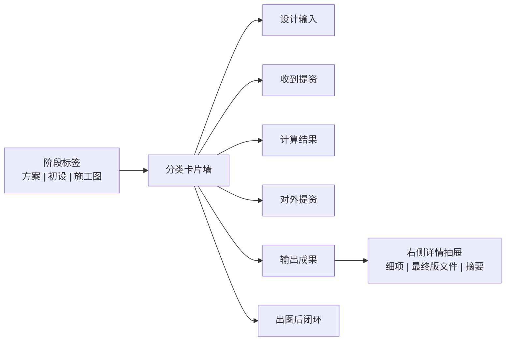
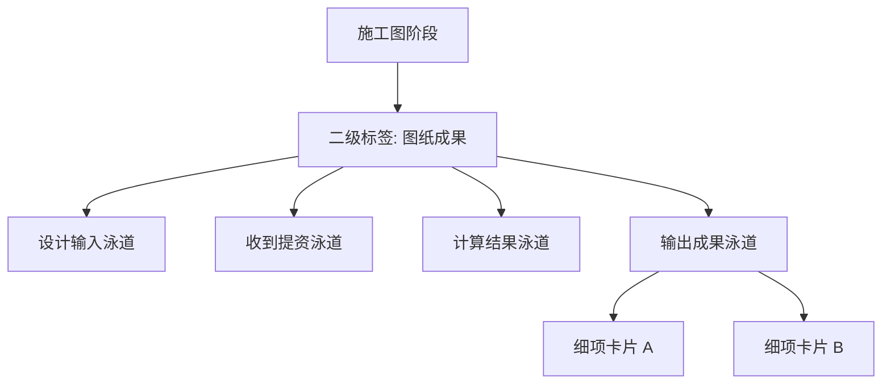
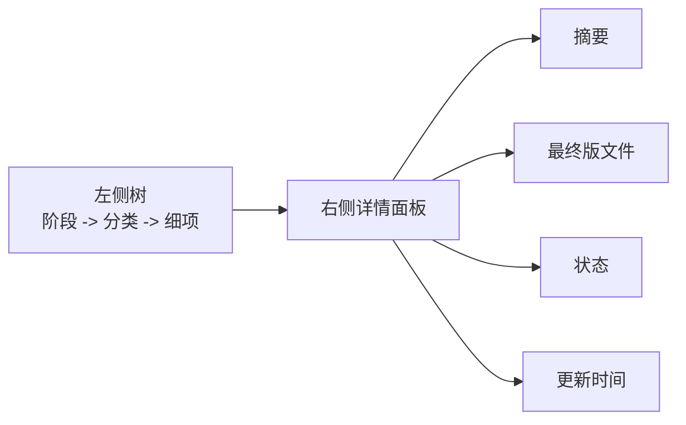

# 轮次问答记录（2026-03-29）
---

## 用户问题（第 1 轮）
结构视图目前设计输入、收到提资、计算结果等是竖向列表，展开的结果也是竖向列表，可以看到结果，但是展示效果不好，可以探讨下更优秀的展示方案，施工阶段可以做成二级标签。先不修改，给我几个方案选择，有示意图最好。

## Codex 最终答复（第 1 轮）
当前这个结构视图的问题很明确：

1. 一级分类和展开结果都沿纵向堆叠，层级一多就会变成长页面。
2. 用户能看到内容，但很难快速形成“这个子项整体完成到哪了”的空间感。
3. `施工阶段` 和前面几个阶段的展示逻辑其实不完全一样，现在被同一种纵向树强行套住了。

我建议你先在下面 3 个方案里选，不要继续在当前纵向树上小修。

**方案 1**
阶段页签 + 分类卡片墙 + 右侧详情抽屉

适合你现在这个项目，信息清楚，改造成本也相对可控。我认为这是当前最优先方案。

展示方式：
- 顶部先切阶段：`方案 / 初设 / 施工图`
- 中间不是竖向列表，而是 `设计输入 / 收到提资 / 计算结果 / 对外提资 / 输出成果 / 出图后闭环 / 设计备注` 这些分类卡片墙
- 每张卡片只显示：状态、完成度、文件数、最后更新时间、是否有风险
- 点击卡片后，在右侧抽屉里展示该分类下的细项、最终版文件、摘要

施工阶段：
- `施工图阶段` 单独加二级标签
- 建议二级标签先做成：`图纸成果`、`设计变更`、`问题闭环`、`归档版本`

示意图：

优点：
- 一眼能看到整体状态
- 不会被长列表拖垮
- 子项主页和设计过程页职责更清楚
- 很适合后续继续加颜色、风险、最终版标记

缺点：
- 细项很多时，还是需要抽屉或二级面板承接

**方案 2**
横向泳道板

这个更偏“管理看板”，适合快速比较各分类在同一阶段的状态。

展示方式：
- 一列一个大类
- 每列下面是细项卡片
- 卡片上显示文件数、最终版、状态、摘要
- 进行中、未开始、已完成通过颜色直接区分

施工阶段：
- `施工图阶段` 内再切二级标签
- 每个二级标签对应一组泳道

示意图：

优点：
- 状态对比直观
- 看“哪里堵住了”很快
- 视觉上比纯列表好很多

缺点：
- 文件和摘要一多，卡片会拥挤
- 对查看具体文件不如双栏结构舒服

**方案 3**
左树右详情

这是最稳的工程型方案，适合文件、细项、版本持续变多的情况。

展示方式：
- 左边只保留紧凑树：`阶段 -> 分类 -> 细项`
- 右边详情区展示当前节点的：摘要、最终版文件、责任人、更新时间、状态
- 左边树只做导航，不承担内容展示

施工阶段：
- 左侧树在 `施工图阶段` 下增加二级标签节点
- 例如：`施工图阶段 -> 图纸成果 / 设计变更 / 问题闭环 / 归档版本`

示意图：

优点：
- 最稳定
- 最适合长期演进
- 文件多时不乱

缺点：
- 第一眼没有方案 1 那么“好看”
- 主页感会更偏系统工具，不像项目总览

**我的建议**
如果你现在要的是“既能看整体，又别太丑，还要方便继续做”，我建议：

1. 子项主页用 `方案 1`
2. 施工阶段加二级标签
3. 右侧详情里只展示最终版文件和摘要
4. 如果后面数据量再上来，再演进到 `方案 3`

也就是说，不建议直接做成纯树，不建议继续堆竖向列表，也不建议现在就做很重的可视化图。

**施工阶段二级标签建议口径**
我建议先固定成这 4 个：

1. `图纸成果`
2. `设计变更`
3. `问题闭环`
4. `归档版本`

这套口径比继续沿用通用分类更适合施工阶段。

你如果要我继续，我建议你直接回复一个编号：

1. 选方案 1
2. 选方案 2
3. 选方案 3
4. 方案 1 为主，但我先把施工阶段二级标签口径再细化一版
---

## 用户问题（第 2 轮）
既能看整体，又别太丑，还要方便继续做，按你的建议来。

## Codex 最终答复（第 2 轮）
已按之前建议把结构视图改成 `阶段标签 + 分类卡片墙 + 右侧详情面板`，并给施工阶段加了二级标签。

主要改动：
- `D:\python\hvac-design-master-main\src\components\dashboard\SubprojectStructureView.tsx`
  - 重写结构视图，不再使用纵向三级展开树。
  - 顶部改成阶段标签切换。
  - 中间改成分类卡片墙，卡片展示状态、完成细项数、已有内容数、最终版文件数、最近更新时间。
  - 右侧新增详情面板，展示当前分类下的细项按钮、变更摘要、说明和最终版文件。
  - `施工` 阶段增加二级标签：`全部 / 图纸成果 / 设计变更 / 问题闭环 / 归档版本`。
- 保留了最终版文件下载、状态颜色和当前阶段标识。

验证结果：
- `npm exec tsc -- --noEmit` 通过
- `npm test` 通过，8 个测试文件、16 个测试全部通过
---

## 用户问题（第 3 轮）
施工阶段二级页签还是用设计输入、计算结果、输出结果、设计备注、收到提资、对外提资、出图后闭环等，目前这几个作为切换按钮太大了，点击后要下滑网页才能看到具体内容

## Codex 最终答复（第 3 轮）
已按你的反馈继续调整结构视图。

主要改动：
- `D:\python\hvac-design-master-main\src\components\dashboard\SubprojectStructureView.tsx`
  - 把分类切换从大卡片改成了紧凑页签。
  - `施工` 阶段的二级页签改回业务分类口径：
    - 设计输入
    - 收到提资
    - 计算结果
    - 对外提资
    - 输出成果
    - 出图后闭环
    - 设计备注
  - 点击分类后，下面直接是细项列表和详情面板，不需要先滚过一大片切换按钮区。
  - 左侧保留细项列表，右侧直接看摘要、说明和最终版文件。

验证结果：
- `npm exec tsc -- --noEmit` 通过
- `npm test` 通过，8 个测试文件、16 个测试全部通过
---

## 用户问题（第 4 轮）
图1展示的位置，二级页签内容占空太大了，完成项，已有记录，最终文件放到第二行即可，还有这个阶段完成需要手动确认。图2细项做成单独一行了，点击细项后在下方展示内容，太占空间了，考虑细项做成左边栏，点击后在右侧产看详细内容。

## Codex 最终答复（第 4 轮）
已按你的反馈继续调整结构视图，并补了阶段完成手动确认。

主要改动：
- `D:\python\hvac-design-master-main\src\types.ts`
  - 新增 `StageConfirmation` 类型。
  - `SubProject` 新增 `stageConfirmations`，用于持久化阶段完成手动确认状态。
- `D:\python\hvac-design-master-main\src\App.tsx`
  - 兼容初始化 `stageConfirmations`。
  - 新增结构视图里的“确认本阶段完成 / 取消完成确认”持久化更新。
  - 确认/取消时会写入业务日志。
- `D:\python\hvac-design-master-main\src\components\dashboard\DashboardView.tsx`
  - 把阶段确认能力传给结构视图。
- `D:\python\hvac-design-master-main\src\components\dashboard\SubprojectStructureView.tsx`
  - 顶部摘要区压缩：完成细项、已有记录、最终版文件放到第二行。
  - 增加阶段完成手动确认按钮和确认人/时间展示。
  - 细项区域改为更早进入左右分栏：左侧细项栏，右侧详细内容。
  - 分栏断点从 `xl` 提前到 `lg`，常见桌面宽度下就能左右布局，不再容易上下堆叠。

验证结果：
- `npm exec tsc -- --noEmit` 通过
- `npm test` 通过，8 个测试文件、16 个测试全部通过

