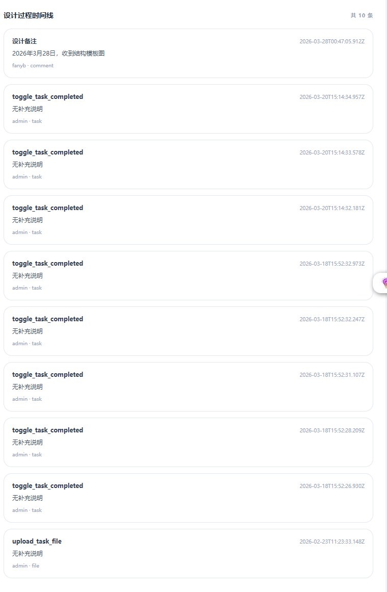

1. 点击导出整个项目，跳出提示窗口如下。

2. 页面逻辑目前有问题，没有体现出我记录设计过程，做设计模板的需求，新增需求文件，落实我的需求，新建2个agent审查下，1个是产品经理负责修改需求，1个是暖通设计负责人，负责审查修改后的修改需求。
3.设计过程时间线我刚开思没写任何备注时，已经有9条记录了，如图所示，没有具体内容，这是啥情况？我看了这是我在子项部分前台极简执行视图大狗的情况，这个记录了，但是记录方式有问题，应该记录具体的内容，而不是就暗淡的task_completed
4.我提的“问题.md”文件中，设计过程分类在页面视图没看到具体体现，目前的前台极简执行视图分类有问题，无法展示具体的设计过程。
